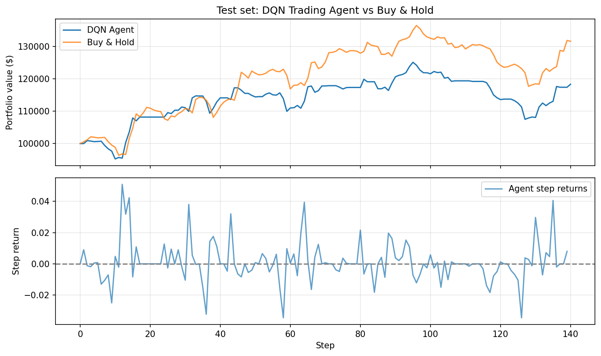

# Reinforcement Learning Trading Agent

A DQN-based agent that learns to make **buy / sell / hold** decisions in a simulated stock market environment.

## Quick start

**Installation**

```bash
pip install -r requirements.txt
```

**Train** the agent on historical data:

```bash
python train.py --symbol AAPL --period 2y --episodes 200
```

**Run** the trained agent on the test set and plot results:

```bash
python run_agent.py --model outputs/dqn_trading.pt --plot outputs/equity_curve.png
```

Use the same `--symbol` (and default `period`/`train_ratio`) as in training so the test split matches.

## Sample results

Example equity curve (DQN agent vs buy-and-hold on the test set):



## Sample train log

```text
Training on 352 days (AAPL)
Episode 20/200 | Steps: 197 | Avg reward (last 20): 0.041436 | ε: 0.942
Episode 40/200 | Steps: 322 | Avg reward (last 20): 0.050355 | ε: 0.887
Episode 60/200 | Steps: 288 | Avg reward (last 20): 0.038212 | ε: 0.834
...
Episode 200/200 | Steps: 301 | Avg reward (last 20): 0.044521 | ε: 0.050
Model saved to outputs/dqn_trading.pt
```

## Sample test log

```text
Plot saved to outputs/equity_curve.png
Agent total return: 0.0546 | Buy & Hold: 0.0516
Agent final value: $105,458.99 | Initial: $100,000.00
```

## Project structure

| File             | Purpose                                                                                                     |
| ---------------- | ----------------------------------------------------------------------------------------------------------- |
| `data_loader.py` | Fetch stock data (Yahoo Finance), compute returns and features, train/test split by time                    |
| `trading_env.py` | Gymnasium environment: state (last 10 returns + position), actions (hold/buy/sell), reward (fractional PnL) |
| `dqn_agent.py`   | DQN with replay buffer, target network, epsilon-greedy exploration                                          |
| `train.py`       | Training loop; saves model and episode rewards to `outputs/`                                                |
| `run_agent.py`   | Load model, run on test set (no exploration), plot equity curve vs buy-and-hold                             |

## Run options

- **train.py**: `--symbol` (default AAPL), `--period` (default 2y), `--episodes` (default 200), `--seed` (default 42).
- **run_agent.py**: `--model` (path to saved `.pt`), `--symbol`, `--plot` (path to save the figure; if set, plot is saved and not shown interactively).

Other parameters (e.g. `train_ratio`, `window_size`) use the same defaults in both train and run; change them in code if needed.

## Outputs

- **outputs/** — created when you run `train.py`; contains `dqn_trading.pt` and `episode_rewards.npy`.
- **outputs/equity_curve.png** — created when you run `run_agent.py` with `--plot outputs/equity_curve.png`.

## Requirements

- Python 3.8+
- See `requirements.txt` for dependencies (gymnasium, torch, pandas, yfinance, matplotlib, numpy).
